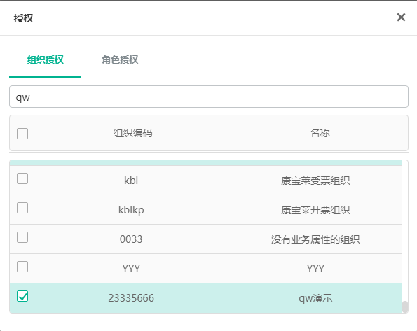

# java模拟赋码开票

## 项目介绍

+ 用java实现软件“用友开票助手”的功能。

+ 可参考“项目相关”目录下的“e-invoice-client”代码，实现部分功能

## 功能要求

+ 支持电子发票与纸质发票，测试用例覆盖度最好能在75%以上，能够运行在Linux环境下

+ 参考功能流程为监听RabbitMQ队列获得MQ消息，JSON转XML，生成回传消息，XML文件存储备份，定时清除过期文件，调用OpenApi接口回传消息

## 用友开票助手功能介绍

### 安装

安装“项目相关”目录下“用友开票助手”中的“税控模拟应用.exe”与“v2.0_2.0.0.21.exe”

### 税控模拟应用


启动后如上图，自主选择纸票输入，纸票结果，电票输入，电票结果的目录后点击启动。

### 用友开票助手


+ 启动后如上图，点击右上角设置


+ 如上图所示可设置地址为192.168.52.80或192.168.52.81 端口皆为80,设置后输入用户密码，可使用用户为gyr01，密码为1qaz2wsx，登录

+ 登录后找到税控信息


+ 如上图所示，选择开票点名称，选择税控设备编号，各个目录，税控软件目录可不选，点击右下角启动服务

+ 可点击右上角帮助查看具体介绍，这里不再赘述

### 开票

+ 登录与用友开票助手设置中一致的网址192.168.52.80或192.168.52.81，账号密码同用友开票助手


+ 进入如上图所示位置


+ 如上图所示，选择开票组织，名称，项目名称，点击开票


+ 如上图所示，如果没有开票成功，票信息将在未开票中，成功则在已开票中,用友开票助手中也会有相应信息的显示，并会创建 目录名称_bak文件夹保存XML文件

+ 以上为开电子发票的流程，纸质发票与此类似，不再赘述

## XML文件样例

可在“项目相关”下找到电子发票与纸质发票的样例

+ 电子发票_1156385194803372032_result.xml为需要“java模拟赋码开票”生成的信息


如上图所示，各字段说明如下

+ FPQQLSH      发票流水号

+ JQBH              机器编号，可按照相应规则模拟生成

+ FP_DM           发票代码，可按照相应规则模拟生成

+ FP_HM           发票号码，可按照相应规则模拟生成

+ KPRQ             开票日期

+ FP_MW          发票密文，可使用样例中的密文

+ JYM                 校验码，可按照相应规则模拟生成


纸质发票与电子发票不同

+ 纸质发票\_1149268201667747840_.xml模拟开票结果为需要“java模拟赋码开票”生成的信息


如上图所示，后面两段数字为FP_DM,FP_HM

## 消息队列

+ #消息队列配置（80）

  ```xml
  spring.rabbitmq.first.host=10.16.2.24
  spring.rabbitmq.first.port=5672
  spring.rabbitmq.first.virtual-host=dev
  spring.rabbitmq.first.username=piaoeda
  spring.rabbitmq.first.password=piaoeda
  ```

+ #消息队列配置（81）

  ```xml
  spring.rabbitmq.first.host=10.16.2.24
  spring.rabbitmq.first.port=5672
  spring.rabbitmq.first.virtual-host=benchmark
  spring.rabbitmq.first.username=piaoeda
  spring.rabbitmq.first.password=piaoeda
  ```

+ 队列名称

```xml
INVOICE-纳税人识别号-税控设备
```

+ 例如

```xml
INVOICE-111222333456111-电票01
```

## JSON转XML

产品使用了一个通用的数据格式转换框架，支持如下：

- json -> json转换
- json -> 实体转换
- xml -- json互转
- xml行列转换

转换工具已开源，详见github地址：


源码目录下的ppt，为转换工具的使用方法。

src/test/java/transform包下，有三个Test类及一个语法检查器。

- EntityTest：实体转换test类
- JSONTest：json格式转换test类
- XMLTest：xml-json互转及xml行列转换test类
- GrammarValidator：转换语法检查器

可通过运行三个Test类，理解转换器的使用方法。

可通过语法检查器，在运行前检查编写的转换语法是否正确。

在实际使用中，可以在pom文件中加入如下依赖：

```xml
<dependency>
  <groupId>com.github.pkuliuqiang</groupId>
  <artifactId>datatransformer</artifactId>
  <version>1.0.1</version>
</dependency>
```

数据转换工具已发布到maven中央仓库，引入依赖即可正确运行。


如有问题，请联系：liuqiangm@yonyou.com，友空间或邮件均可。

## 助手消息回传

参考http://192.168.52.96:8181/docs/fapiao/fapiao-1ani5gf7b2q0d中的助手消息回传

补充说明，请求参数中的“data”字段被base64编码

## 创建组织


+ 如上图所示，可自行添加组织，启用开票功能后要添加税控设备，无税控设备无法开票


+ 添加组织后，进入应用设置下的用户管理，找到自己的用户，点击授权，如上图所示



+ 找到组织，授权，如上图所示，之后便可以使用此组织开票

## 项目相关清单

| 文件夹           | 说明                                     |
| ---------------- | ---------------------------------------- |
| e-invoice-client | 可参考项目，包含RabbitMQ相关及MQ消息实体 |
| RabbitMQ配置     | RabbitMQ配置信息                         |
| 规范             | 用友项目相关规范                         |
| 样例             | 电子发票与纸质发票样例                   |
| 用友开票助手     | 安装程序                                 |

